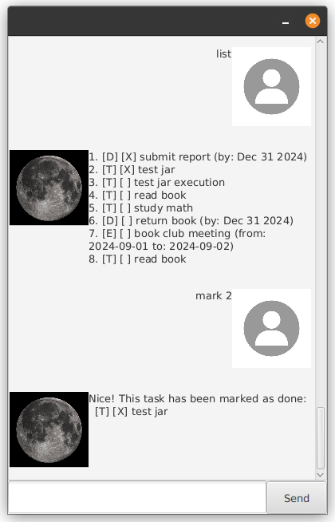

# Luna User Guide

Luna is a **desktop app for managing tasks, optimized for use via a Command Line Interface** (CLI) while still having the benefits of a Graphical User Interface (GUI). If you can type fast, Luna can get your task management done faster than traditional GUI apps.

* [Quick start](#quick-start)
* [Features](#features)
  * [Adding a todo task: `todo`](#adding-a-todo-task-todo)
  * [Adding a deadline task: `deadline`](#adding-a-deadline-task-deadline)
  * [Adding an event task: `event`](#adding-an-event-task-event)
  * [Listing all tasks: `list`](#listing-all-tasks-list)
  * [Marking a task as done: `mark`](#marking-a-task-as-done-mark)
  * [Marking a task as not done: `unmark`](#marking-a-task-as-not-done-unmark)
  * [Deleting a task: `delete`](#deleting-a-task-delete)
  * [Finding tasks: `find`](#finding-tasks-find)
  * [Undo last action: `undo`](#undo-last-action-undo)
  * [Exiting the program: `bye`](#exiting-the-program-bye)
* [Command summary](#command-summary)

--------------------------------------------------------------------------------------------------------------------

## Quick start

1. Ensure you have Java `11` or above installed in your Computer.

1. Download the latest `luna.jar` from [here]().

1. Copy the file to the folder you want to use as the _home folder_ for your Luna chatbot.

1. Open a command terminal, `cd` into the folder you put the jar file in, and use the `java -jar luna.jar` command to run the application. 
   A GUI similar to the below should appear in a few seconds. Note how the app contains some sample data. 
   

1. Type the command in the command box and press Enter to execute it. e.g. typing **`list`** and pressing Enter will show all tasks. 
   Some example commands you can try:

   * `list` : Lists all tasks.

   * `todo read book` : Adds a todo task named "read book" to the task list.

   * `delete 3` : Deletes the 3rd task shown in the current list.

   * `bye` : Exits the app.

1. Refer to the [Features](#features) below for details of each command.

--------------------------------------------------------------------------------------------------------------------

## Features

**Notes about the command format** 

* Words in `UPPER_CASE` are the parameters to be supplied by the user. 
  e.g. in `todo DESCRIPTION`, `DESCRIPTION` is a parameter which can be used as `todo read book`.

* Items in square brackets are optional. 

### Adding a todo task: `todo`

Adds a todo task to the task list.

Format: `todo DESCRIPTION`

Examples:
* `todo read book`
* `todo submit assignment`

### Adding a deadline task: `deadline`

Adds a deadline task with a due date to the task list.

Format: `deadline DESCRIPTION /by DATE`

* The `DATE` can be in various formats such as `2024-12-25`, `Dec 25 2024`, or `25/12/2024`.

Examples:
* `deadline submit report /by 2024-12-25`
* `deadline pay bills /by Dec 31 2024`

### Adding an event task: `event`

Adds an event task with start and end times to the task list.

Format: `event DESCRIPTION /from START_TIME /to END_TIME`

* The `START_TIME` and `END_TIME` can be in various formats such as `2024-12-25 14:00`, `Dec 25 2024 2pm`, or `25/12/2024 14:00`.

Examples:
* `event team meeting /from 2024-12-25 14:00 /to 2024-12-25 16:00`
* `event conference /from Dec 25 2024 9am /to Dec 25 2024 5pm`

### Listing all tasks: `list`

Shows a list of all tasks in the task list.

Format: `list`

### Marking a task as done: `mark`

Marks the specified task as done.

Format: `mark INDEX`

* Marks the task at the specified `INDEX` as done.
* The index refers to the index number shown in the displayed task list.
* The index **must be a positive integer** 1, 2, 3, …​

Examples:
* `list` followed by `mark 2` marks the 2nd task in the task list as done.

### Marking a task as not done: `unmark`

Marks the specified task as not done.

Format: `unmark INDEX`

* Marks the task at the specified `INDEX` as not done.
* The index refers to the index number shown in the displayed task list.
* The index **must be a positive integer** 1, 2, 3, …​

Examples:
* `list` followed by `unmark 1` marks the 1st task in the task list as not done.

### Deleting a task: `delete`

Deletes the specified task from the task list.

Format: `delete INDEX`

* Deletes the task at the specified `INDEX`.
* The index refers to the index number shown in the displayed task list.
* The index **must be a positive integer** 1, 2, 3, …​

Examples:
* `list` followed by `delete 2` deletes the 2nd task in the task list.

### Finding tasks: `find`

Finds tasks whose descriptions contain any of the given keywords.

Format: `find KEYWORD [MORE_KEYWORDS]`

* The search is case-insensitive. e.g `book` will match `Book`
* Only the task description is searched.
* Only full word matches will be returned. e.g. `book` will not match `books`
* Tasks matching at least one keyword will be returned (i.e. `OR` search).
  e.g. `book report` will return tasks containing `book`, `report`, or both.

Examples:
* `find book` returns `read book` and `buy cook book`
* `find meeting project` returns `team meeting`, `project discussion`, `submit project`

### Undo last action: `undo`

Undoes the last action that modified the task list.

Format: `undo`

* Only actions that modify the task list can be undone (add, mark, unmark, delete).
* Only the last action can be undone. Multiple undos are not supported.

Examples:
* `delete 1` followed by `undo` will restore the deleted task.
* `mark 2` followed by `undo` will unmark the task.

### Exiting the program: `bye`

Exits the program.

Format: `bye`

--------------------------------------------------------------------------------------------------------------------

## Command summary

Action | Format, Examples
--------|------------------
**Add Todo** | `todo DESCRIPTION`   e.g., `todo read book`
**Add Deadline** | `deadline DESCRIPTION /by DATE`   e.g., `deadline submit report /by 2024-12-25`
**Add Event** | `event DESCRIPTION /from START_TIME /to END_TIME`   e.g., `event team meeting /from 2024-12-25 14:00 /to 2024-12-25 16:00`
**List** | `list`
**Mark** | `mark INDEX`  e.g., `mark 3`
**Unmark** | `unmark INDEX`  e.g., `unmark 1`
**Delete** | `delete INDEX`  e.g., `delete 3`
**Find** | `find KEYWORD [MORE_KEYWORDS]`  e.g., `find book report`
**Undo** | `undo`
**Exit** | `bye`
